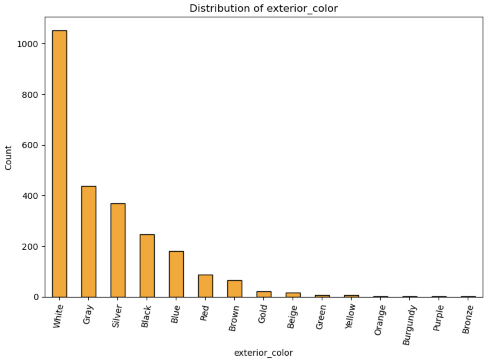
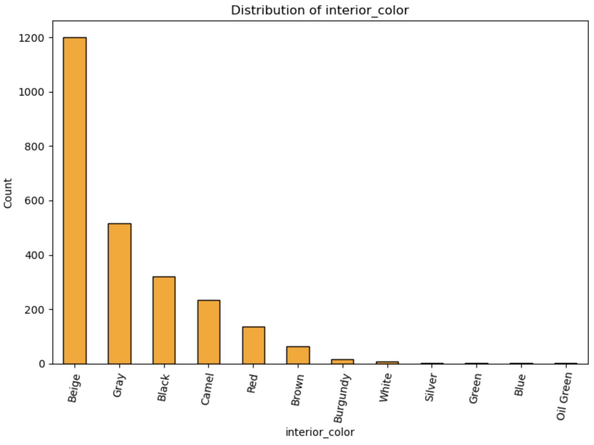
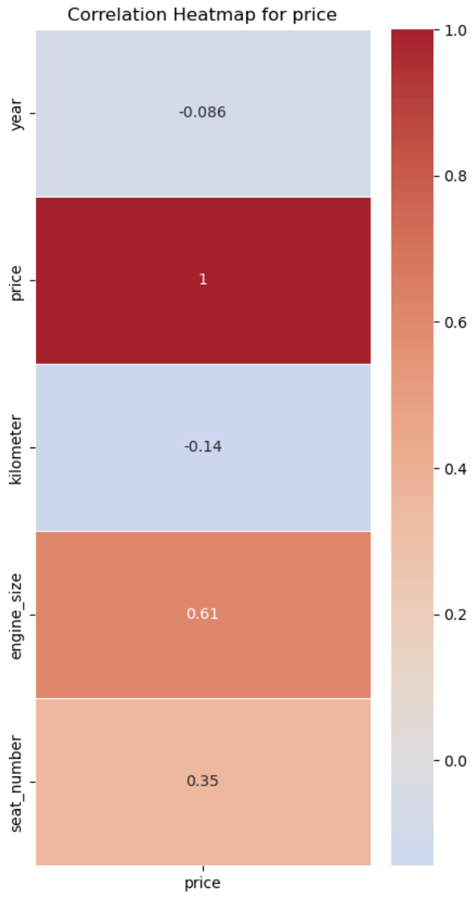
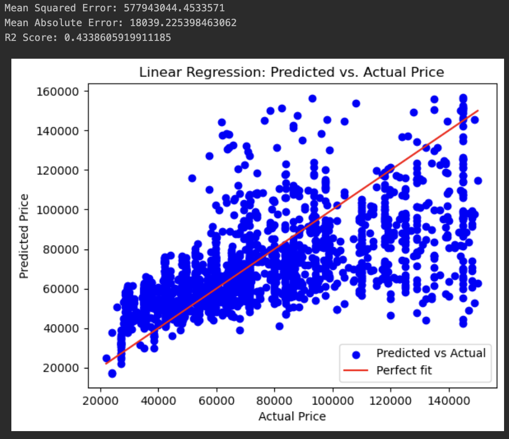
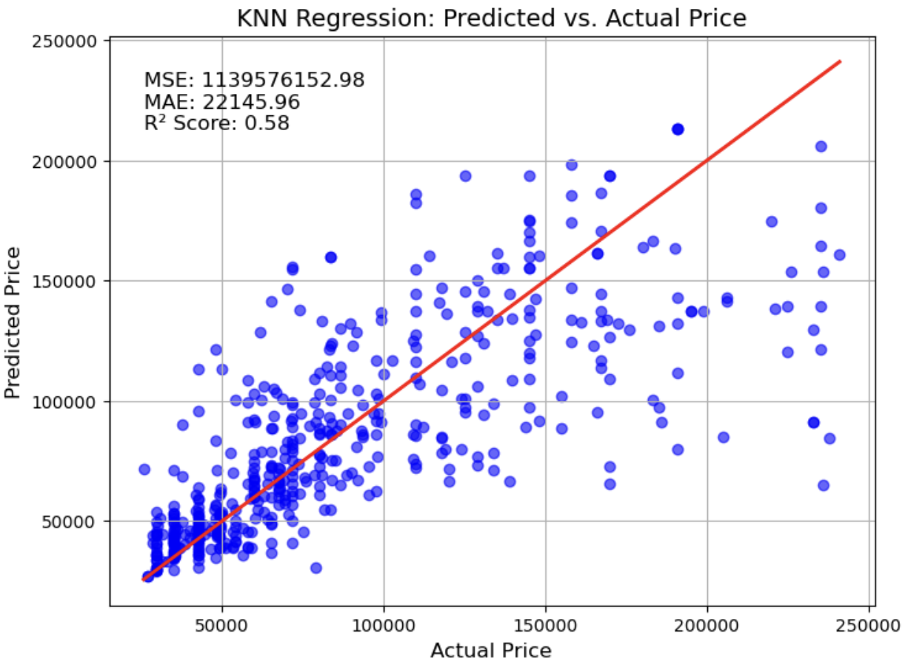

# thammenha
Tuwaiq Data Science &amp; Machine Learning Capstone

The current situation in the Saudi Used Car Market is in dire need of tools and services to simplify the process of evaluating cars.

### Team Members:

 - Ahmed Alsubhi
 - Faisal Alzahrani
 - Salman Gassem
 - Ziyad Aljaser

### Problem Statement
Websites issues:
 1. Unregulated pricing.
 2. Personal opinions.
 3. Unreliable.

Going in person to the physical market also has its drawbacks:

 1. Evaluations are always below actual value.
 2. Unfair pricing.
 3. Can be easily taken advantage of.
 4. Inconvenient.
 5. Weeks to find out the market value
 6. Financial Overhead
 7. Time cost

## Solution

Develop a Machine Learning model that learns from the KSA Used Car market to be able to estimate the prices properly.

#### Objectives:
 - Collect local used car data.
 - Create a Machine Learning model using the data collected.
 - Develop a separate model on a separate dataset for comparison purposes.

#### Implementation Plan:
 - Deliver the service through a website.
 - Create an API for the model.
 - Users enter features to find their car’s value.

### Data Collection

 - The KSA data was scraped from the website Syarah.com.
 - Collected a dataset from the USA market to compare from websites such as Kaggle, Medium, and so on.

### Model Training

The model training is still undergoing.

### EDA for the Saudi Data

The dataset consists of the following columns:

1. Brand
2. Model
3. Year
4. Price
5. Kilometer
6. Fuel Type
7. Gear Type
8. Engine Size
9. Drivetrain
10. Trim
11. Exterior Color
12. Interior Color
13. Seat Number
14. Origin

#### Insights

The Saudi market prefers White cars the most with Beige interior. Possibly due to the extreme heat weather.

And it seems as though the pricing does not seem to be related to the car's Kilometers as much as previously believed so. Perhaps people here value the car's brand the most when it comes to estimating the car's value?

<!--  -->

#### Initial Base Linear Regression model

#### Initial Base KNN model

